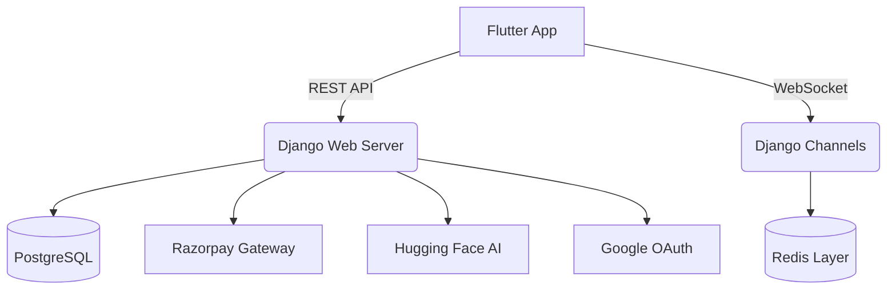

# 🛒 CartBuddy: Collaborative Quick-Commerce Ordering

**CartBuddy** is a playful, modern, and gamified platform designed to eliminate the "delivery fee tax" on quick-commerce. By enabling hyper-local group ordering, CartBuddy helps students and urban residents split delivery costs, reach order thresholds faster, and build community through shared shopping journeys.

---

## 🧠 Problem Statement

* **Delivery Fee Fatigue**: Individual orders on platforms like Blinkit, Zepto, or Swiggy often incur heavy delivery and "small order" fees.
* **Inefficient Logistics**: Multiple delivery riders arriving at the same hostel or apartment building simultaneously creates unnecessary traffic and carbon footprint.
* **Social Isolation**: Shopping has moved from a communal activity to a lonely digital chore.

---

## 💡 Solution Overview

CartBuddy enables users to join **Shared Carts** in real-time. Instead of ordering alone, you join a "Room" for your preferred store, contribute your items, and the system optimizes the delivery cost across all participants.

* **Split the Bill**: Delivery fees are divided equally or proportionally.
* **Beat the Threshold**: Group up to reach "Free Delivery" minimums effortlessly.
* **Safe & Moderated**: Built-in AI moderation ensures group chats stay friendly and professional.

---

## 🎯 Key Features

* 🛒 **Real-time Order Rooms**: Join or create carts with live updates via WebSockets.
* ⚡ **AI-Moderated Chat**: Advanced toxiticity detection, PII masking (phones/emails), and "Desi Slur" fuzzy matching.
* 🛡️ **Strike-Based Penalty System**: Users sending toxic messages receive strikes; 7 strikes lead to account suspension and removal from the order.
* 💸 **Seamless Payments**: Integrated Razorpay checkout with a local Wallet system for instant refunds and payouts.
* 🔔 **Smart Handoff**: Secure OTP-based delivery verification from Host to Joiners.
* ⏱️ **Pickup Timer**: 15-minute countdown once order arrives to ensure everyone reaches on time; late arrivals incur a "Late Fee" on their next order.

---

## 🏗️ Tech Stack

### Frontend
- **Framework**: Flutter (Multi-platform)
- **UI Library**: [ForUI](https://forui.dev/) (Shadcn-inspired aesthetics)
- **State Management**: Flutter Riverpod
- **Storage**: Flutter Secure Storage

### Backend
- **Framework**: Django & Django REST Framework (DRF)
- **Real-time**: Django Channels (ASGI) & Redis
- **Authentication**: JWT & Google OAuth 2.0
- **Moderation Engine**: Hugging Face Inference (`multilingual-toxic-xlm-roberta`)

### Database
- **Primary**: PostgreSQL
- **Caching/Real-time**: Redis
- **Local fuzzy matching**: SQLite (for high-speed slur detection)

---

## 🧩 Architecture Overview

---

## 🔄 How It Works

1. **Discovery**: User finds a CartBuddy Room for their hostel or campus.
2. **Drafting**: User adds items to the shared cart and chats with others in the room.
3. **Locking**: Once the threshold is met, the Host locks the room.
4. **Checkout**: Participants pay their share via Razorpay.
5. **Arrival**: Host marks order as "Prepared/Arrived". A **15-minute timer** starts for all participants.
6. **Completion**: Participants reach the Host, share their OTP, and the Host verifies to release funds.

---

## 🧪 Challenges We Faced

* **Real-time Synchronization**: Managing WebSocket states across multiple participants to ensure cart totals stay accurate to the cent.
* **Fuzzy Moderation**: Building a normalization engine that can catch `chuuuuutiya` or `b!tch` without blocking innocent words.
* **Trust Mechanics**: Implementing a penalty system (Late Fees / Strikes) that discourages bad behavior without being overly punitive.

---

## 🚀 Future Scope

- **AI Recommendations**: Suggestions to "Add one more item" to hit a discount tier.
- **Platform Integration**: Deep links to Zepto/Blinkit to auto-populate carts.
- **Hyperlocal Maps**: Live location tracking of participants during the handoff phase.

---

## 👥 Team
* **Aditya Dua** — Project Lead & Backend Architect
* **Antigravity** — AI Pair Programmer & Moderation Logic

---

## ⚙️ Installation & Setup

### Backend
1. `cd backend`
2. `python -m venv venv && source venv/bin/activate`
3. `pip install -r requirements.txt`
4. `python manage.py migrate`
5. `python manage.py runserver`

### Frontend
1. `cd frontend`
2. `flutter pub get`
3. `flutter run`

---

## 📜 License
Distributed under the MIT License. See `LICENSE` for more information.
